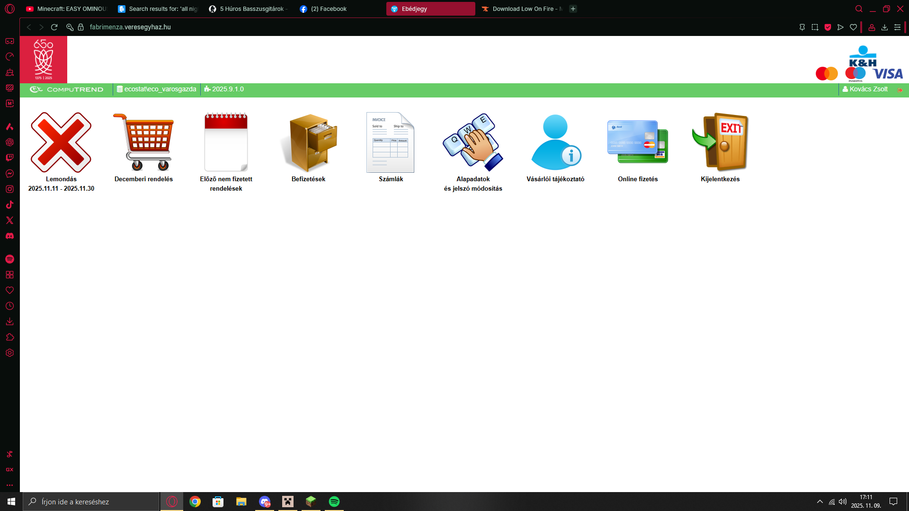
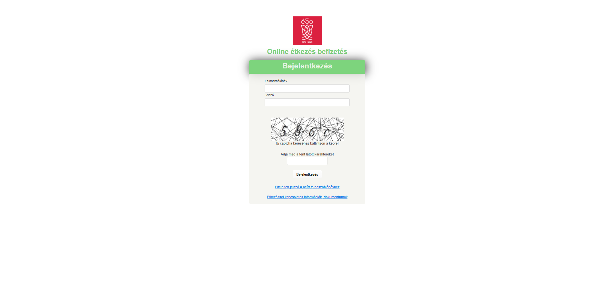

# Kolonics_Kovacs-Projekt

## Készítette
Kolonics Márk 11.D

Kovács Péter 11.D

### Áttekintés

A projektben egy weblapot dolgozunk át. A honlap ami átdolgozásra került azt a csatolt képeken tudják megnézni, ugyanis az oldal korlátozott bejelentkezéssel tekinthető meg. A honlap főoldala a `fooldal.html` fájl.

## Megtekintés 

- [Főoldal](fooldal.html)
- [Referencia oldal](https://fabrimenza.veresegyhaz.hu/)
- [Trello](https://trello.com/b/PgOzPcGa/projektmunkakolonicskovacs)

## Referencia képek

Az alábbi képek a `Referencia_oldal` mappából kerülnek beillesztésre (ha a képek még nincsenek a helyi gépen, a `Referencia_oldal` mappába kell másolni őket):

