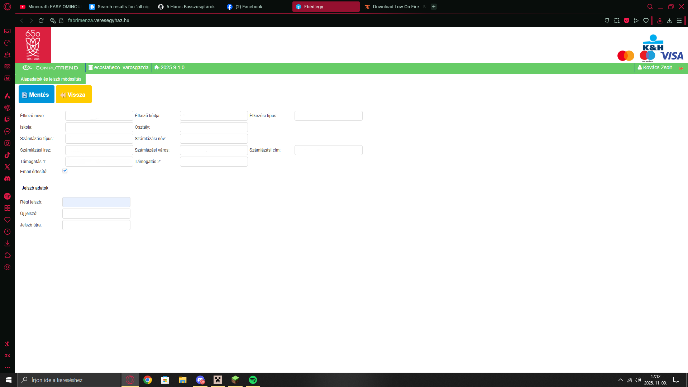
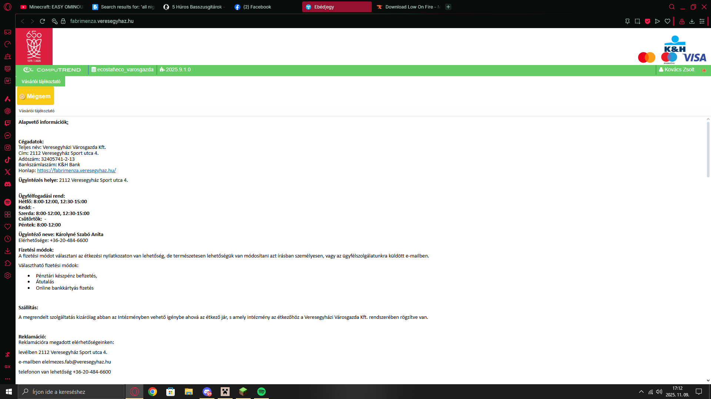

## 👥 Készítette
**Kolonics Márk** 11.D  
**Kovács Péter** 11.D

---

## 📋 Projekt célja és áttekintése

Az **Online Étkezés Befizetési Rendszer** átdolgozása és modernizálása. A projekt középpontjában egy felhasználóbarát, reszponzív webfelület áll, amely egyaránt szolgálja az esztétikus megjelenést és a funkcionális hatékonyságot.

### Fő célkitűzések:
- **Modern esztétika**: Friss, kort követő dizájn a Veres Egyházi Iskola arculatának megfelelően
- **Mobilbarát felület**: Teljes reszponzivitás — asztali, tablet és mobilnézet támogatása
- **Felhasználói élmény (UX)**: Intuitív navigáció, gyors betöltés, szimbolikus és tiszta interfész
- **Biztonság**: Jelszó kezelés, bejelentkezési folyamat validálása, form validáció
- **Karbantarthatóság**: Moduláris szerkezet, tiszta kódszervezet, dokumentáció

---

## 🔗 Demo és linkek

- **[Live Demo](https://kolomarki08.github.io/Kolonics_Kovacs-Projekt/bejeletkezes.html)**
- **[Főoldal](fooldal.html)**
- **[Referencia honlap](https://fabrimenza.veresegyhaz.hu/)**
- **[Trello — Projektmenedzsment](https://trello.com/b/PgOzPcGa/projektmunkakolonicskovacs)**

---

## 🚀 Használat

### Helyileg futtatás:
```bash
# A projekt az alábbi fájlokkal indítható
# 1. Nyisd meg a pages/bejeletkezes.html fájlt böngészőben
# 2. Vagy használj egy lokális szerveret (pl. Live Server, python -m http.server)
```

### Telepítés (jövőbeli):
```bash
git clone https://github.com/KoloMarki08/Kolonics_Kovacs-Projekt.git
cd Kolonics_Kovacs-Projekt
# Helyileg futtatás vagy deployment
```

---

## 📋 Referencia képek

Az átdolgozás során az alábbi referenciafotók inspirálnak:






---

## 🛠️ Technológiák

- **HTML5** — Szemantikus jelölés
- **CSS3** — Modern stílusok, Flexbox, Grid, Media Queries
- **JavaScript (ES6+)** — Interaktivitás és felhasználói élmény
- **PHP** (szerveroldalon) — Bejelentkezési logika, adatkezelés

---

**Projekt szerzői:**  
- Kolonics Márk
- Kovács Péter

Kérdések vagy észrevételek? Nyiss egy issue-t vagy lépj kapcsolatba a szerzőkkel a Trello táblán.

---